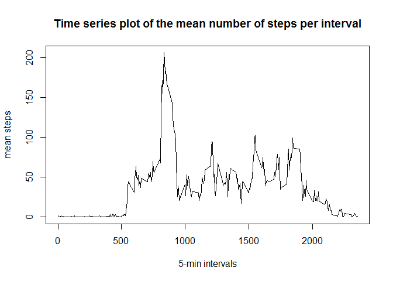

# Reproducible Research Assignment 1


## Loading and preprocessing the data


```r
library(dplyr)
library(ggplot2)
library(lubridate)

options(scipen=999)

# load the dataset
df = read.csv('activity.csv')
```

## What is the mean total number of steps taken per day?

```r
# Find the total number of steps taken each day
df2 = df %>% group_by(date) %>% summarise(totalsteps = sum(steps, na.rm = TRUE))

# Make a histogram of the total number of steps taken each day
hist(df2$totalsteps, xlab="total number of steps per day", ylab="frequency",
     main='Histogram of total number of steps taken per day')
```

<!-- -->

```r
# Calculate mean and median steps taken each day
mean(df2$totalsteps, na.rm = TRUE)
```

```
## [1] 9354.23
```

```r
median(df2$totalsteps, na.rm = TRUE)
```

```
## [1] 10395
```
The mean of the total number of steps taken per day is 9354
and the median is 10395.


## What is the average daily activity pattern?

```r
# Find the average steps by day for each interval
df3 = df %>% group_by(interval) %>% summarise(meansteps = round(mean(steps, na.rm = TRUE)))
```

```
## Warning: package 'bindrcpp' was built under R version 3.3.3
```

```r
# Make a time series plot of the mean steps per interval
plot(df3$interval, df3$meansteps, type='l',
     xlab="5-min intervals", ylab="mean steps",
     main = 'Time series plot of the mean number of steps per interval')
```

<!-- -->

```r
# Identify interval with the highest mean steps
filter(df3, meansteps == max(df3$meansteps)) %>% select(interval)
```

```
## # A tibble: 1 x 1
##   interval
##      <int>
## 1      835
```

The 5-minute interval with the maximum average steps is 835.


## Imputing missing values


```r
# Calculate the number of rows with missing values
sum(is.na(df))
```

```
## [1] 2304
```
The total number of rows with missing values is 2304. 

To impute the missing values I will replace them with the mean interval step value. First I will identify the missing step value and the interval is it associated with. Then I will find the mean step value for that interval and replace the missing value with it.


```r
# I will replace missing step values with interval 
# mean step value

# Copy original dataset
dfimputed = df

# Find the interval value for each missing step 
# and replace the missing step with the mean
# interval value

for(i in 1:nrow(dfimputed)){
  if (is.na(dfimputed$steps[i])){
    index = dfimputed$interval[i]
    replacementValue = df3[df3$interval == index,2]
    dfimputed$steps2[i] = unlist(replacementValue)
  }
  else dfimputed$steps2[i] = unlist(dfimputed$steps[i])
}


# Find the total number of steps taken each day using imputed data
dfimputed2 = dfimputed %>% group_by(date) %>% 
  summarise(totalsteps = sum(steps2, na.rm = TRUE))

# Make a histogram of the total number of steps taken each day using imputed data
hist(dfimputed2$totalsteps, xlab="total number of steps per day", ylab="frequency",
     main='Histogram of total number of steps taken per day using imputed data')
```

<!-- -->

```r
# Calculate mean and median steps taken each day using imputed data
mean(dfimputed2$totalsteps, na.rm = TRUE)
```

```
## [1] 10765.64
```

```r
median(dfimputed2$totalsteps, na.rm = TRUE)
```

```
## [1] 10762
```

The mean total number of steps taken per day with the imputed dataset is 10766
and the median is 10762. By imputing the missing data, the data has become more normally distributed.


## Are there differences in activity patterns between weekdays and weekends?


```r
# Find whether day was weekend or weekday
dfimputed3 = dfimputed %>% mutate(day = weekdays(ymd(dfimputed$date)),
                     weekday = ifelse(day == 'Saturday' | day == 'Sunday', 'weekend','weekday'))

dfimputed3$weekday = as.factor(dfimputed3$weekday)

# Find the average steps by day for each interval and group by weekend or weekday
dfimputed4 = dfimputed3 %>% group_by(interval, weekday) %>% summarise(meansteps = mean(steps2, na.rm = TRUE))


# Make a time series plot of the mean steps per interval
ggplot(data = dfimputed4, aes(x = interval, y = meansteps, group = weekday)) +
  geom_line() +
  facet_grid(weekday ~ .) +
  labs(x = '5-min intervals', y = 'mean steps', title = 'Mean number of steps taken per day')
```

<!-- -->


